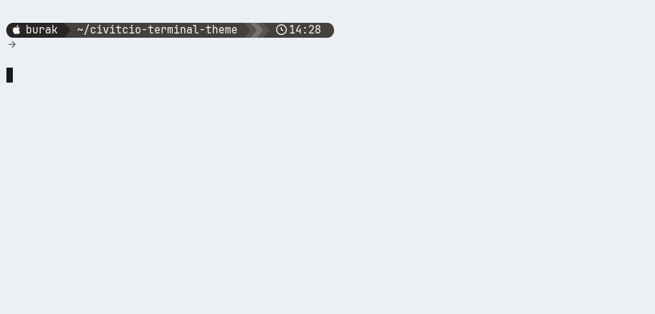

# civitcio-terminal-theme

Calm dual theme for **terminal + [starship](https://starship.rs)** — macOS and Linux.
Same powerline look, two moods:

| Calm-Dark — dark `#1c1917` + white pills | Calm-Light — off-white `#fafaf9` + dark pills |
| --- | --- |
|  |  |

> GIF backgrounds are approximate (rendered with agg's github-dark/light).
> The exact terminal colors ship as native profiles (see below).

## Restore in one line (same on macOS and Linux)

```sh
curl -fsSL https://raw.githubusercontent.com/bcivitcioglu/civitcio-terminal-theme/main/install.sh | bash
```

Then reload your shell and switch:

```sh
exec zsh   # or: exec bash
theme-dark   # dark #1c1917 + starship calm_white
theme-light  # off-white #fafaf9 + starship calm_dark
```

Or clone and run locally:

```sh
git clone https://github.com/bcivitcioglu/civitcio-terminal-theme.git
cd civitcio-terminal-theme
./install.sh
```

## What's inside

| File | Installs to |
| --- | --- |
| `starship.toml` | `~/.config/starship.toml` (palettes `calm_white`, `calm_dark`; `gruvbox_dark` kept) |
| `shell/theme.sh` | `~/.config/civitcio-theme/theme.sh`, sourced from `~/.bashrc` + `~/.zshrc` — portable `theme-dark` / `theme-light` switchers |
| `terminal/Calm-Dark.terminal` | macOS: Terminal.app profile, warm-black bg `#1c1917`, soft-white text |
| `terminal/Calm-Light.terminal` | macOS: Terminal.app profile, off-white bg `#fafaf9`, dark-gray text |
| `linux/gnome-terminal.sh` | Linux: GNOME Terminal `Calm-Dark` / `Calm-Light` profiles via `gsettings` |
| `linux/ghostty/calm-dark`, `calm-light` | Linux: Ghostty drop-in themes (`~/.config/ghostty/themes/`) |
| `linux/alacritty/calm-dark.toml`, `calm-light.toml` | Linux: Alacritty drop-in themes (`~/.config/alacritty/themes/`) |
| `zsh/snippet.zsh` | legacy shim, sources `shell/theme.sh` |
| `Brewfile` | macOS: `starship` + `font-jetbrains-mono-nerd-font` |
| `demo/` | scripts to regenerate the GIFs (`./demo/render.sh`, macOS dev machine) |

`install.sh` backs up your existing `~/.config/starship.toml` to `/tmp/starship.toml.backup.*`
and sets `Calm-Dark` as the default (Terminal.app default profile on macOS,
GNOME Terminal default profile on Linux).

## Requirements

- macOS + Apple Terminal, or Linux (bash/zsh) + GNOME Terminal / Ghostty / Alacritty
  (other Linux terminals: starship + switchers still work, terminal colors stay manual)
- macOS: [Homebrew](https://brew.sh) (installed automatically if missing)
- Linux: `curl unzip fontconfig` (e.g. `sudo apt install curl unzip fontconfig`),
  starship installs to `~/.local/bin` without sudo
- A Nerd Font (installed automatically) — set your terminal font to
  **JetBrainsMono Nerd Font Mono** (prompts use powerline glyphs)

## Revert

```sh
# starship: set palette back, e.g. (portable sed)
sed -i.bak "s/^palette = .*/palette = 'gruvbox_dark'/" ~/.config/starship.toml; rm -f ~/.config/starship.toml.bak
# macOS terminal: Settings > Profiles > pick your old profile as Default
# Linux GNOME: Preferences > Profiles, or
#   gsettings set org.gnome.Terminal.ProfilesList default "'<old-uuid>'"
```
